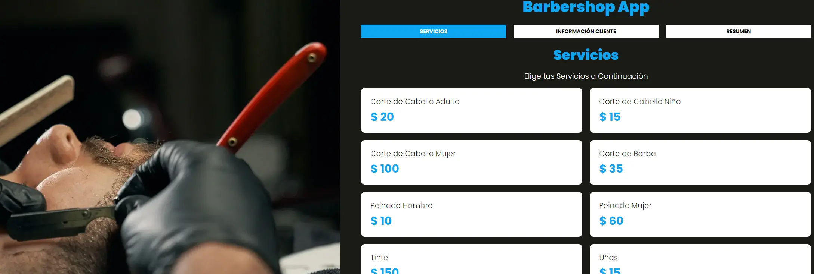

[](https://barbershop-mv.netlify.app/)

# Barbershop App

This project *Barbershop App* was made with the purpose of putting into practice basic concepts in the development of Web sites, using  HTML, SASS, JavaScript and Gulp.

## Development server

[Live Server](https://marketplace.visualstudio.com/items?itemName=ritwickdey.LiveServer)

## Building and Running for Production

1. Install the Gulp CLI

   ```sh
   npm install --global gulp-cli
   ```
2. Install dependencies

    ```sh   
   npm install
    ```

3. Run Gulp

    ```sh   
   gulp
    ```


